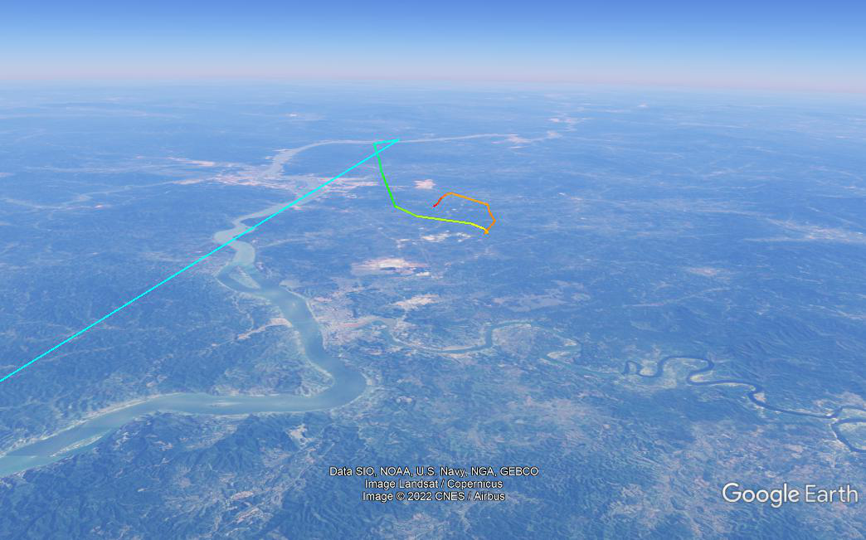

# mu5735

ADS-B data of the MU5735 crash, collected from flightradar24.
For educational purposes only.

`Detailed Data`: https://twitter.com/flightradar24/status/1505863117343014916/photo/2

`Coarse Data`: https://www.flightradar24.com/data/aircraft/b-1791#2b367bc1

`KML`: [Open](out.kml)

## Flight Path

## Altitude

## Speed

## Vertical Speed

## Heading
