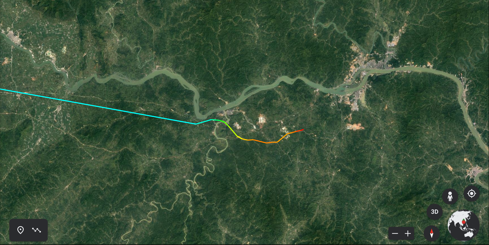

# mu5735

ADS-B data, graphs and basic analysis for the crash of [Chinese Eastern Flight 5735](https://en.wikipedia.org/wiki/China_Eastern_Airlines_Flight_5735), collected from flightradar24 ([granular data](https://www.flightradar24.com/blog/china-eastern-airlines-flight-5735-crashes-en-route-to-guangzhou/), [detailed data](https://twitter.com/flightradar24/status/1505863117343014916/photo/2), [coarse data](https://www.flightradar24.com/data/aircraft/b-1791#2b367bc1)).

For educational purposes only.

[Download KML](https://github.com/cathaypacific8747/mu5735/releases/download/v0.1/MU5735-Flightradar24-Granular-Data.kml)

## Flight Path

Towards east:

Towards west:

Top view:

Entire path:

## Flight Parameter changes before crash

